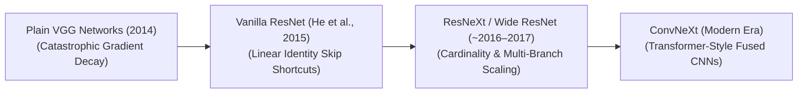
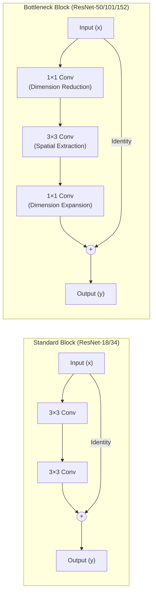

# Awesome-Residual-Networks
## Residual Networks (ResNets): Evolution, Variants, Types, & Applications

A Residual Network (ResNet) is a hardware-aware deep convolutional neural network architecture that revolutionized the training of deep neural networks. Introduced by Kaiming He, Xiangyu Zhang, Shaoqing Ren, and Jian Sun in 2015 ("Deep Residual Learning for Image Recognition"), ResNets solved the foundational **vanishing/exploding gradient problem** in ultra-deep networks. Prior to ResNets, stacking layers past a depth of 20 resulted in a severe degradation of training accuracy because error gradients decayed exponentially as they backpropagated through the network graph. ResNets introduced **Residual Skip Connections** (shortcut connections) that skip over blocks of layers, allowing gradients to flow directly through a linear identity highway ($y = F(x) + x$) without attenuation, which unlocked stable training for networks exceeding 100 to 1,000+ layers.

---

## 1. The Chronological Evolution

The architectural implementation of residual mapping has transitioned from static baseline shortcuts to wider channel dimensions, bottleneck structures, and modern transformer-inspired deep vision layers.

*   **The Deep Degradation Era (Plain VGG Style, Pre-2015)**
    *   *Concept:* The structural baseline. Networks were scaled up by simply stacking standard convolutional layers sequentially. 
    *   *Limitation:* Catastrophic degradation. Stacking layers past 20 caused gradients to vanish during backpropagation, resulting in higher training errors for deeper networks than for shallower networks, capping architectural scaling bounds.
*   **The Residual Shortcut Breakthrough (He et al., 2015)**
    *   *Concept:* The defining milestone of computer vision. Instead of forcing stacked layers to fit an absolute underlying mapping $H(x)$, ResNets forced the layers to learn a residual mapping: $F(x) = H(x) - x$. The original input $x$ is appended straight to the output via a non-parameterized identity shortcut loop, computing $F(x) + x$.
    *   *Significance:* Fully dissolved the vanishing gradient barrier. ResNet won the ImageNet 2015 challenge by stably training **ResNet-50** and **ResNet-152** structures, surpassing human-level accuracy on vision classification tasks.
*   **The Dimensional and Width Scaling Era (~2016–2020)**
    *   *Concept:* Expanded the structural dimensions of residual blocks. **Wide ResNets (WRNs)** demonstrated that widening channel dimensions within a residual block is more effective than expanding depth raw parameters. Concurrently, **ResNeXt (2017)** introduced **Cardinality**—replacing single dense residual transformations with multi-branch, parallelized grouped convolutions.
*   **The Modernized Transformer-Hybrid Era (~2022–Present)**
    *   *Concept:* Driven by the competitive scaling properties of Vision Transformers (ViTs). Architectures like Meta's **ConvNeXt** modernized the classical ResNet backbone by integrating modern design principles (e.g., swapping traditional bottleneck ratios for inverted bottlenecks, utilizing layer normalization instead of batch normalization, and expanding convolutional kernel sizes from $3 \times 3$ to $7 \times 7$).

---

## 2. Core Block & Architectural Variants

The ResNet family tree is categorized based on how the internal hidden layers of the residual cell are routed and scaled mathematically.

*   **Basic Block (ResNet-18 / ResNet-34)**
    *   *Mechanism:* Composed of two consecutive $3 \times 3$ convolutional layers wrapped around an identity skip connection. Used primarily for low-parameter, fast inference tracking loops.
*   **Bottleneck Block (ResNet-50 / ResNet-101 / ResNet-152)**
    *   *Mechanism:* Deploys a three-layer sequence: a $1 \times 1$ convolution (to compress the channel dimensions), a $3 \times 3$ convolution (for spatial feature mapping), and a final $1 \times 1$ convolution (to expand the channels back out).
    *   *Pros:* Significantly reduces computational floating-point operations (FLOPs), allowing networks to scale up parameter depth cleanly without hitting memory bandwidth ceilings.
*   **Pre-Activation ResNet (ResNet-v2)**
    *   *Mechanism:* Re-arranges the layer normalization sequence. It places the Batch Normalization and ReLU activation function *before* the convolutional layer rather than after it.
    *   *Pros:* Makes the shortcut highway completely unobstructed, improving gradient flow during backpropagation and stabilizing convergence for models exceeding 1,000 layers.
*   **ResNeXt (Cardinality Integration)**
    *   *Mechanism:* Splits the intermediate $3 \times 3$ bottleneck path into an ensemble of parallel, isolated convolution paths (e.g., 32 grouped paths). 
    *   *Pros:* Vastly improves accuracy over standard ResNets at equivalent parameter capacities by distributing feature extraction across distinct representation namespaces.

---

## 3. High-Capacity Architectural Extensions

Beyond 2D vision classification networks, the mathematical properties of residual connections serve as a foundational anchor across alternative deep learning layouts.

*   **Neural Ordinary Differential Equations (Neural ODEs)**
    *   *Profile:* Continual-Time Generalization. It proves that as residual layer steps become infinitely thin, a ResNet mathematically approximates an Euler discretization of an ordinary differential equation, replacing discrete blocks with continuous-time vector field solvers.
*   **U-Net Symmetrical Lateral Residuals**
    *   *Profile:* High-Resolution Spatial Routing. Used heavily in dense pixel semantic segmentation pipelines. Symmetrical residual skip bridges copy fine-grained border features straight from early encoder stages over to terminal decoding steps, ensuring crisp edge outputs.
*   **Transformer Residual Post-Normalization (Post-LN vs. Pre-LN)**
    *   *Profile:* Structural stability inside Large Language Models. Self-attention blocks are wrapped around residual connections to pass gradients stably over deep transformer graphs, utilizing Pre-LN configurations to avoid optimization divergence during multi-node pre-training loops.

---

## 4. Production Engineering Challenges & Hardware Solutions

Deploying large-scale residual configurations within real-world engineering constraints requires balancing memory caching with silicon hardware parallelism.

*   **The Activation Memory Wall (HBM Allocation Explosion)**
    *   *The Problem:* Storing the intermediate feature maps for every individual convolutional channel layer across a 152-layer ResNet during training loops creates a massive multi-gigabyte memory footprint. This saturates GPU High Bandwidth Memory (HBM) bus lines, triggering Out-of-Memory crashes.
    *   *Mitigation:* Implementing **Selective Activation Checkpointing**—discarding non-boundary activation maps immediately after forward pass execution and rematerializing them on-the-fly inside fast registers during backpropagation.
*   **The Unstructured Padding Core Stall**
    *   *The Problem:* When executing downsampling steps across residual shortcuts (where spatial dimensions shrink by half and channels double), the shapes do not match. Using unoptimized projection layers or unstructured zero-padding shifts tensor shapes unevenly, breaking hardware tensor core alignment.
    *   *Mitigation:* Utilizing **Handwritten Fused Triton Kernels** or optimized $1 \times 1$ stride-2 convolutional projection paths to force shape conversion adjustments to happen contiguously inside GPU SRAM registers.

---

## 5. Frontier Real-World AI Applications

*   **Autonomous Vehicle Bird's-Eye-View (BEV) Perception Stacks**
    *   *Application:* Processes multiple real-time, high-frame-rate streaming cameras and lidar grids concurrently. Deep ResNet and ConvNeXt backbones serve as the core feature extraction engines, mapping raw pixel coordinates straight into 3D BEV vector grids to execute multi-object tracking and path navigation safely.
*   **High-Resolution Clinical Diagnostic Imaging (MedTech)**
    *   *Application:* Ingests multi-megapixel anatomical data matrices (such as MRIs, CT volumes, and digital pathology slides). Symmetrical residual encoder-decoder graphs (U-Net variants) automate pixel-level tumor tracking, helping radiologists evaluate rare pathologies with sub-millimeter precision.
*   **Industrial High-Speed Automated Quality Control**
    *   *Application:* Monitors manufacturing assembly lines. Compact, mobile-friendly ResNet and depthwise-separable variants are compiled directly onto local edge microcontrollers, parsing live camera inputs to screen circuit boards for micro-defects (such as surface fractures or misaligned rivets) and halting conveyor belts instantly.

---

To proceed with your technical setup, workspace environment, or documentation repository optimization, choose from the adjacent follow-up tracks:
* I can provide a **complete Python code boilerplate using PyTorch** demonstrating how to write a custom Bottleneck Residual Block module containing a projection shortcut path from scratch.
* I can generate a **Markdown matrix table** explicitly comparing Standard ResNet Blocks, Bottleneck Blocks, ResNeXt Grouped Blocks, and ConvNeXt Inverted Bottleneck Blocks across computational complexities, parameter footprint metrics, and target hardware configurations.
* I can write a detailed technical explanation focusing on the **mathematics of Pre-Activation ResNets**, outlining the exact gradient tracking equations that guarantee monotonic loss convergence over thousands of layers.

