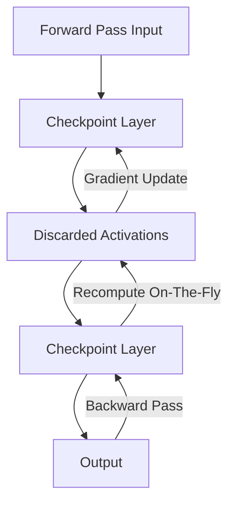

# The Activation Memory Wall (HBM Allocation Explosion)

## Overview
During backpropagation, deep learning frameworks need to store the intermediate activation tensors generated during the forward pass to compute gradients. For extremely deep ResNets, these activations consume massive amounts of memory, creating a bottleneck known as the "Activation Memory Wall."

## Mitigation: Selective Activation Checkpointing
Instead of storing all intermediate activations, checkpointing stores activations at only a few boundary layers. During the backward pass, the omitted activations are re-computed on-the-fly from the nearest checkpoint, reducing peak memory usage from $O(N)$ to $O(\sqrt{N})$.

## Diagram

## References
- Chen, T., Xu, B., Zhang, C., & Guestrin, C. (2016). Training Deep Nets with Sublinear Memory Cost. arXiv preprint arXiv:1604.06174.

[← Back to README](../README.md)
