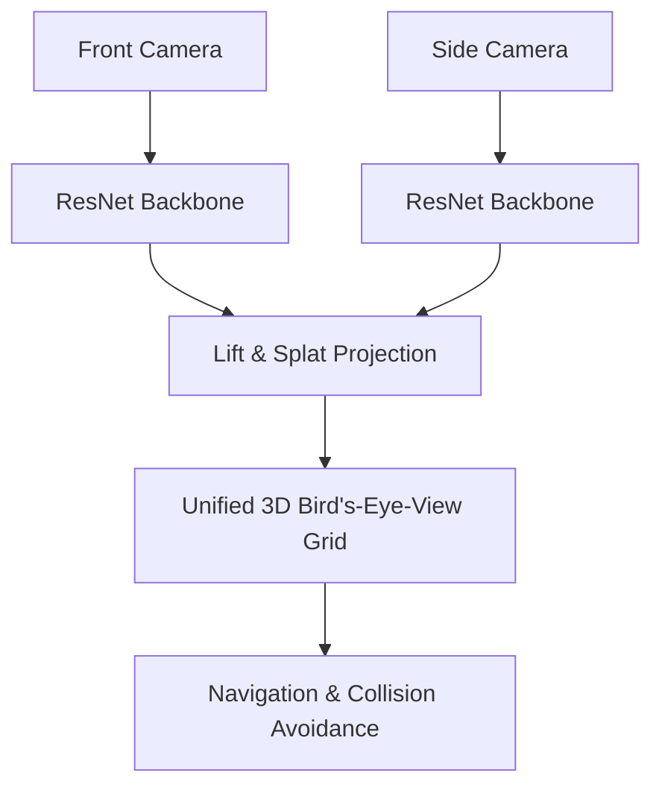

# Autonomous Vehicle Bird's-Eye-View (BEV) Perception Stacks

## Overview
Autonomous driving perception stacks process multiple real-time camera streams to build a unified 3D map around the vehicle. This is often done by converting 2D perspective images into a Bird's-Eye-View (BEV) representation.

## Role of Residual Networks
Deep ResNet or ConvNeXt architectures are used as backbone feature extractors for each camera stream. The extracted 2D multi-scale features are then projected (e.g., using Lift, Splat, Shoot) into 3D voxel space, enabling safe path planning, obstacle detection, and lane tracking.

## Diagram

## References
- Philion, J., & Fidler, S. (2020). Lift, Splat, Shoot: Encoding Images from Arbitrary Cameras via 3D Virtual Cameras. arXiv preprint arXiv:2008.05711.

[← Back to README](../README.md)
