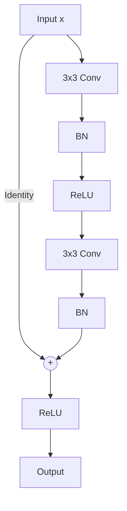

# Basic Block (ResNet-18 / ResNet-34)

## Overview
The Basic Block is the simplest unit of standard ResNet models. It consists of two consecutive $3 \times 3$ convolutional layers wrapped with an identity skip connection.

## Structure
- Conv 1 ($3 \times 3$, stride 1 or 2)
- Batch Normalization & ReLU
- Conv 2 ($3 \times 3$, stride 1)
- Batch Normalization
- Addition of Input (Shortcut)
- ReLU

## Diagram

## References
- He, K., Zhang, X., Ren, S., & Sun, J. (2015). Deep Residual Learning for Image Recognition. arXiv preprint arXiv:1512.03385.

[← Back to README](../README.md)
