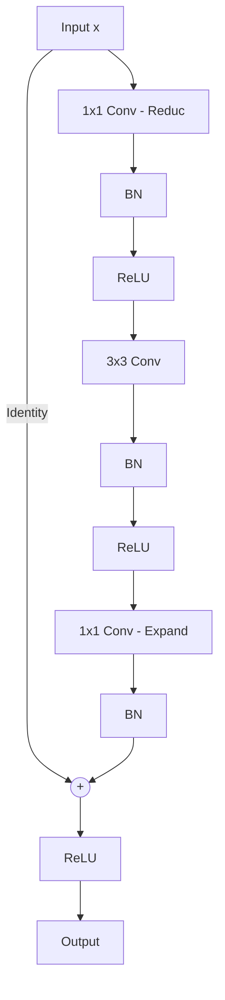

# Bottleneck Block (ResNet-50 / ResNet-101 / ResNet-152)

## Overview
The Bottleneck Block is designed for deeper networks (ResNet-50 and above). It uses three layers instead of two: $1 \times 1$, $3 \times 3$, and $1 \times 1$ convolutions.

## Mechanism
- The first $1 \times 1$ convolution reduces the feature map dimensions.
- The $3 \times 3$ convolution performs spatial feature extraction.
- The final $1 \times 1$ convolution restores the channel dimensions.
This reduction-restoration cycle reduces parameters and FLOPs significantly, allowing models to scale deeper.

## Diagram

## References
- He, K., Zhang, X., Ren, S., & Sun, J. (2015). Deep Residual Learning for Image Recognition. arXiv preprint arXiv:1512.03385.

[← Back to README](../README.md)
