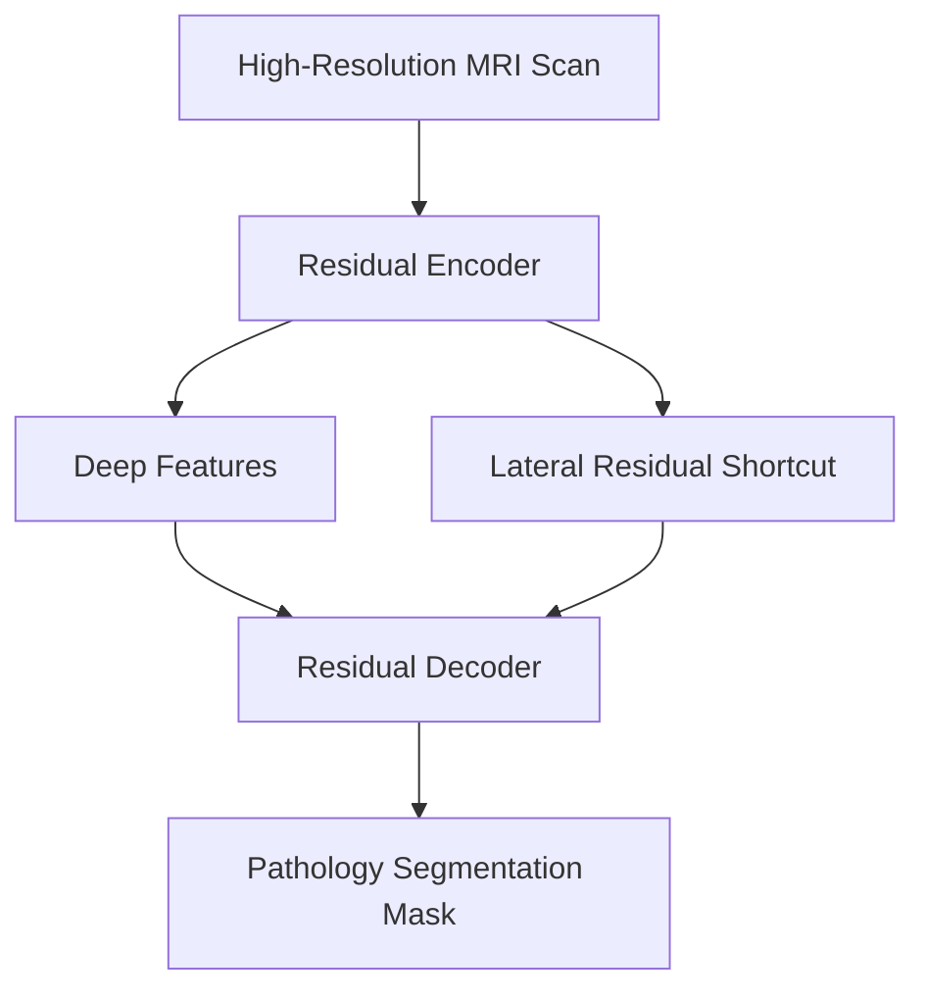

# High-Resolution Clinical Diagnostic Imaging (MedTech)

## Overview
Medical image analysis (such as CT scans, MRIs, and pathology slides) requires extreme precision. Deep networks are deployed to detect anomalies, segment tumors, and assist clinical workflows.

## Role of Residual Networks
Architectures like U-Net integrated with residual connections (Res-UNet) allow deeper feature extraction without optimization issues. They prevent the loss of spatial details across downsampling blocks, which is critical for identifying sub-millimeter pathologies.

## Diagram

## References
- Ronneberger, O., Fischer, P., & Brox, T. (2015). U-Net: Convolutional Networks for Biomedical Image Segmentation. arXiv preprint arXiv:1505.04597.

[← Back to README](../README.md)
