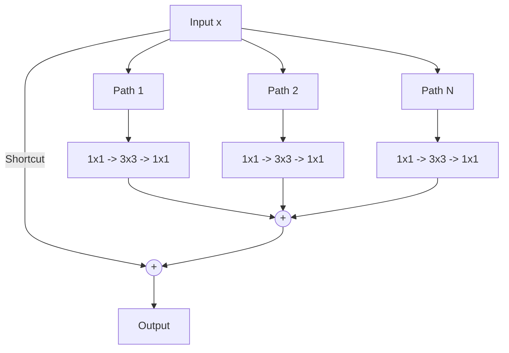

# The Dimensional and Width Scaling Era (~2016–2020)

## Overview
After the success of standard ResNets, researchers explored scaling other dimensions of the network. Wide Residual Networks (WRNs) showed that increasing the width (number of channels) of residual blocks is more effective than stacking layers deeper. ResNeXt introduced Cardinality (the size of the set of transformations) as a new dimension.

## Key Architectures
1. **Wide ResNets (WRNs):** Introduced a widening factor $k$ to scale the channel widths of blocks.
2. **ResNeXt:** Introduced grouped convolutions to split a bottleneck block into parallel paths.

## Diagram

## References
- Zagoruyko, S., & Komodakis, N. (2016). Wide Residual Networks. arXiv preprint arXiv:1605.07146.
- Xie, S., Girshick, R., Dollár, P., Tu, Z., & He, K. (2017). Aggregated Residual Transformations for Deep Neural Networks. arXiv preprint arXiv:1611.05431.

[← Back to README](../README.md)
