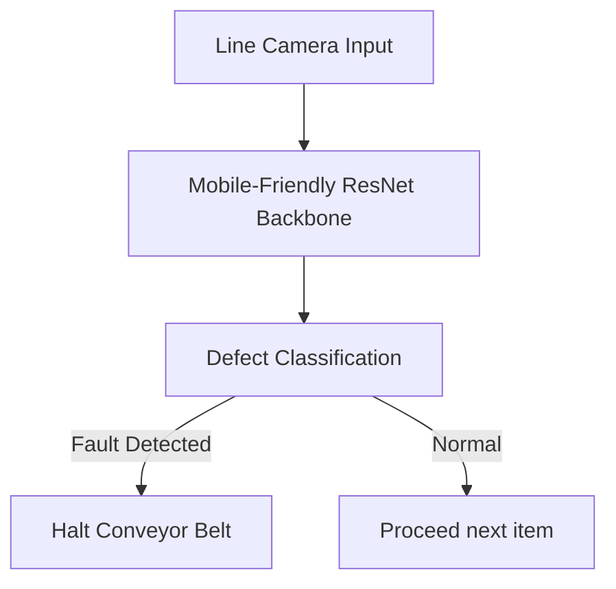

# Industrial High-Speed Automated Quality Control

## Overview
Manufacturing assembly lines require instantaneous inspections to detect defect rates and maintain high quality. Deployments require lightweight architectures that run directly on edge microcontrollers.

## Role of Residual Networks
Compact ResNets, combined with depthwise separable convolutions (like MobileNetV2 / ConvNeXt-nano), compile onto low-power edge computers. They classify incoming products (e.g., checking for micro-fractures, missing rivets, or misaligned solder) within milliseconds, instantly shutting down conveyor belts if faults are found.

## Diagram

## References
- Howard, A. G., Zhu, M., Chen, B., Kalenichenko, D., Wang, W., Weyand, T., ... & Adam, H. (2017). MobileNets: Efficient Convolutional Neural Networks for Mobile Vision Applications. arXiv preprint arXiv:1704.04861.

[← Back to README](../README.md)
