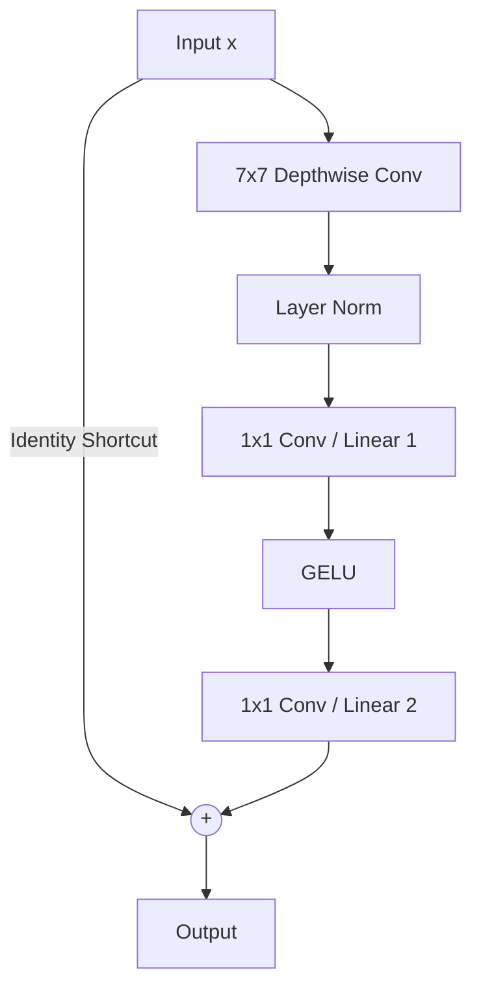

# The Modernized Transformer-Hybrid Era (~2022–Present)

## Overview
With Vision Transformers (ViTs) showing superior scalability, researchers proposed modernizing convolutional networks to match them. ConvNeXt is a prime example of a modernized CNN that retains the simplicity of ResNets while adopting Transformer-style design choices.

## Modernization Steps
- Swapping standard bottleneck ratios for inverted bottlenecks.
- Expanding kernel sizes (from $3 \times 3$ to $7 \times 7$).
- Using Layer Normalization instead of Batch Normalization.
- Using GELU instead of ReLU.

## Diagram

## References
- Liu, Z., Mao, H., Wu, C. Y., Feichtenhofer, C., Darrell, T., & Xie, S. (2022). A ConvNet for the 2020s. arXiv preprint arXiv:2201.03545.

[← Back to README](../README.md)
