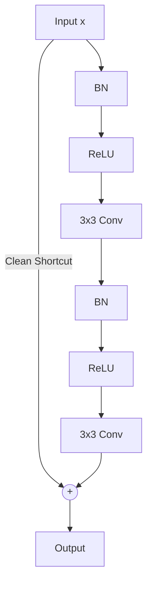

# Pre-Activation ResNet (ResNet-v2)

## Overview
Pre-Activation ResNet (ResNet-v2) reorganizes the order of operations in the residual block. It places Batch Normalization (BN) and ReLU activation *before* the convolutional layers instead of after.

## Advantages
- **Clean Shortcut Pathway:** The identity shortcut path becomes completely unobstructed, allowing gradients to flow back directly through the network without passing through activations.
- **Improved Regularization & Convergence:** Eases training and mitigates overfitting, enabling networks to Converge better even past 1,000 layers.

## Diagram

## References
- He, K., Zhang, X., Ren, S., & Sun, J. (2016). Identity Mappings in Deep Residual Networks. arXiv preprint arXiv:1603.05027.

[← Back to README](../README.md)
