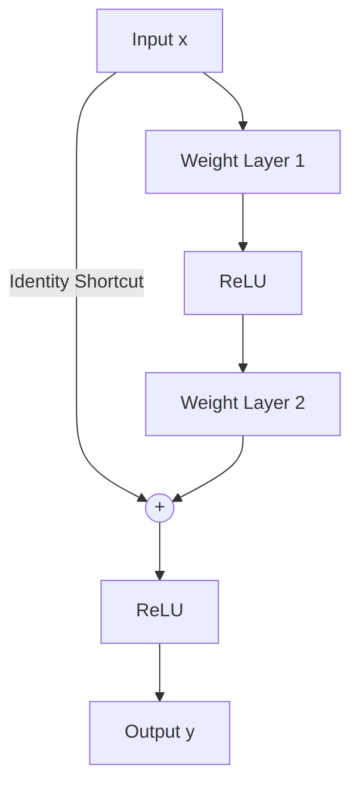

# The Residual Shortcut Breakthrough (He et al., 2015)

## Overview
Introduced by Kaiming He et al., the residual shortcut connection revolutionized deep learning. Instead of forcing stacked layers to fit an absolute mapping $H(x)$, ResNets force the layers to learn a residual mapping $F(x) = H(x) - x$. 

## Mechanism
The identity shortcut connection skips one or more layers and performs an element-wise addition:
$$y = F(x, \{W_i\}) + x$$
This simple addition introduces no extra parameters or computational complexity, yet it guarantees that gradients can flow back directly through the identity connection without attenuation.

## Diagram

## References
- He, K., Zhang, X., Ren, S., & Sun, J. (2015). Deep Residual Learning for Image Recognition. arXiv preprint arXiv:1512.03385.

[← Back to README](../README.md)
