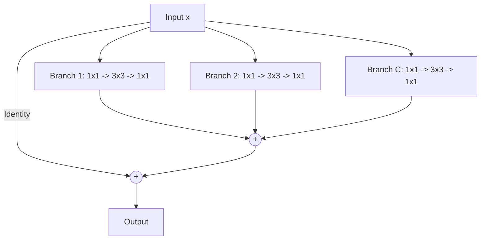

# ResNeXt (Cardinality Integration)

## Overview
ResNeXt scales network performance by introducing **Cardinality** (the size of the set of transformations) as a third dimension, alongside depth and width. 

## Key Concept
Instead of a single large convolutional path, the bottleneck layer is split into multiple parallel, smaller paths (grouped convolutions). This represents an ensemble of transformations.
- Splitting the channel operations reduces computation while maintaining accuracy.
- Improves representations by dividing search spaces.

## Diagram

## References
- Xie, S., Girshick, R., Dollár, P., Tu, Z., & He, K. (2017). Aggregated Residual Transformations for Deep Neural Networks. arXiv preprint arXiv:1611.05431.

[← Back to README](../README.md)
