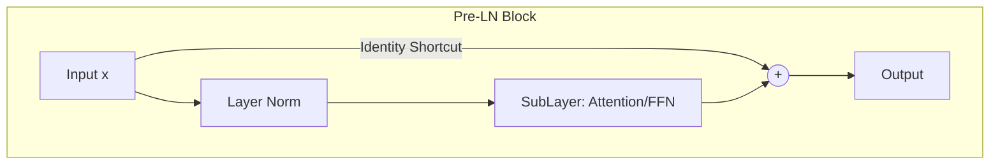

# Transformer Residual Post-Normalization (Post-LN vs. Pre-LN)

## Overview
Residual connections are crucial in Transformer architectures (like BERT, GPT, and LLMs). They help pass gradients stably across deep self-attention layers. Two main normalization placements are used: Post-LN and Pre-LN.

## Post-LN vs. Pre-LN
- **Post-LN (Attention is All You Need, 2017):** Normalization is applied *after* the addition:
  $$x_{t+1} = \text{LayerNorm}(x_t + \text{SubLayer}(x_t))$$
  Can suffer from high gradient variance near output layers, requiring careful warmup schedules.
- **Pre-LN:** Normalization is applied *before* the sub-layer:
  $$x_{t+1} = x_t + \text{SubLayer}(\text{LayerNorm}(x_t))$$
  Leads to much more stable gradients at initialization, removing the need for strict warmup scheduling.

## Diagram

## References
- Vaswani, A., Shazeer, N., Parmar, N., Uszkoreit, J., Jones, L., Gomez, A. N., ... & Polosukhin, I. (2017). Attention Is All You Need. arXiv preprint arXiv:1706.03762.
- Xiong, R., Yang, Y., He, D., Zheng, K., Zheng, S., Xing, C., ... & Liu, T. (2020). On Layer Normalization in the Transformer Architecture. arXiv preprint arXiv:2002.04745.

[← Back to README](../README.md)
