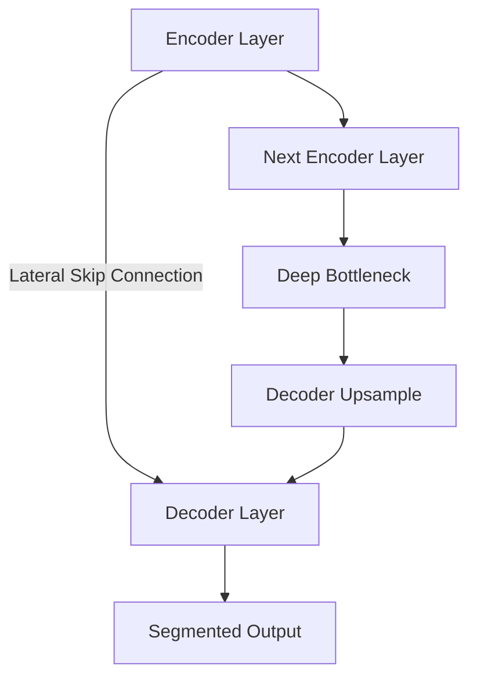

# U-Net Symmetrical Lateral Residuals

## Overview
In semantic segmentation networks like U-Net, high-resolution boundary features are combined with rich low-resolution context. Incorporating residual blocks on the lateral skip connections (or within the encoder/decoder blocks themselves) improves representation learning and convergence.

## Mechanism
- Encoder extracts deep semantic representations.
- Lateral connections route spatial details from early encoder blocks straight to decoder steps.
- Symmetrical residual blocks process these shortcuts to merge features cleanly.

## Diagram

## References
- Ronneberger, O., Fischer, P., & Brox, T. (2015). U-Net: Convolutional Networks for Biomedical Image Segmentation. arXiv preprint arXiv:1505.04597.

[← Back to README](../README.md)
