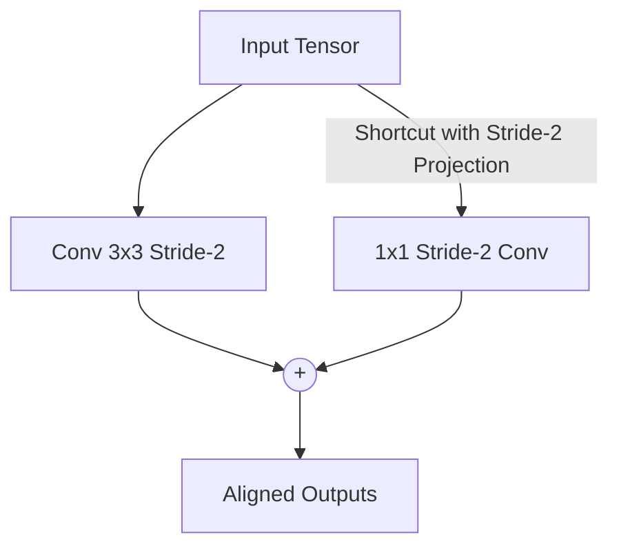

# The Unstructured Padding Core Stall

## Overview
When executing downsampling steps across residual shortcuts (where spatial dimensions shrink by half and channels double), the shapes do not match. Using unoptimized projection layers or unstructured zero-padding shifts tensor shapes unevenly, breaking hardware tensor core alignment and causing execution stalls.

## Mitigation
Utilizing handwritten fused kernels (such as Triton kernels) or optimized $1 \times 1$ stride-2 convolutional projection paths forces shape conversion adjustments to happen contiguously inside GPU SRAM registers, avoiding memory access penalties and stalls.

## Diagram

## References
- Tillet, P., Kung, H. T., & Cox, D. (2019). Triton: An Intermediate Language and Compiler for Tiled Neural Network Computations. MAPL.

[← Back to README](../README.md)
